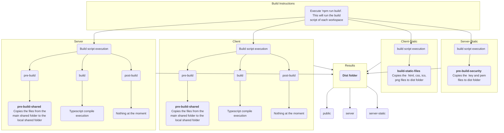

```mermaid
graph TD;
direction TB
subgraph Build Instructions;
direction TB
    C("Execute 'npm run build'. <br/> This will run the build script of each workspace");
    end;

    subgraph Server;    
    C-->W1("Build script execution");  
    W1-->W11("pre-build");
    W1-->W12("build");
    W12-->W121("Typescript compile execution");    
    W1-->W13("post-build");
    W13-->W131("Nothing at the moment");
    W11-->W111("<b>pre-build-shared</b> <br/> Copies the files from the main shared folder to the local shared folder");
end;

subgraph Client;
direction TB    
    C-->S1("Build script execution");  
    S1-->S11("pre-build");
    S1-->S12("build");
    S12-->S121("Typescript compile execution");    
    S1-->S13("post-build");
    S13-->S131("Nothing at the moment");
    S11-->S111("<b>pre-build-shared</b> <br/> Copies the files from the main shared folder to the local shared folder");
end;
subgraph Client-Static;    
direction TB
    C-->CS1("build script execution");          
    CS1-->CS13("<b>build-static-files</b> <br/> Copies the  html, css, ico, png files to dist folder");        
end;
subgraph Server-Static;    
direction TB
    C-->SS1("build script execution");          
    SS1-->SS13("<b>pre-build-security</b> <br/> Copies the  key and pem files to dist folder");        
end;

subgraph Results; 
   direction TB
    DIST("<b>Dist<b/> folder");
    end;

Server-->Results;
Client-->Results;
Client-Static-->Results;
Server-Static-->Results;

Results-->PublicF("public");
Results-->ServerF("server");
Results-->ServerStaticF("server-static");
```