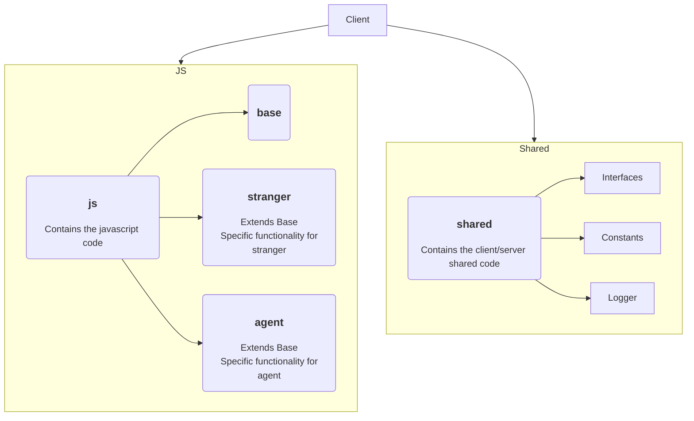

```mermaid
graph TD
direction TB    
  Client[Client];       
    subgraph JS;        
        JSFolder --> Base[base];
        JSFolder --> Stranger[stranger];
        JSFolder --> Agent[agent];        
   end;
   subgraph Shared;        
        SharedFolder --> IF[Interfaces];
        SharedFolder --> CONST[Constants];
        SharedFolder --> LOG[Logger];
   end;
    Client-->JS;
    Client-->Shared;
 

    %% Descriptions
    JSFolder("<h3>js</h3>Contains the javascript code");
    SharedFolder("<h3>shared</h3>Contains the client/server shared code");
    Base("<h3>base</h3>");
    Stranger("<h3>stranger</h3> Extends Base <br/> Specific functionality for stranger");
    Agent("<h3>agent</h3> Extends Base <br/> Specific functionality for agent");
    
```