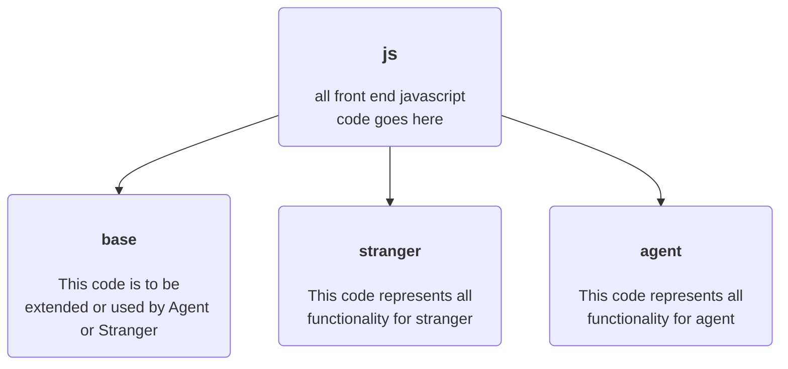

```mermaid
graph TD
    js[js];    
    js -->base;
    js -->stranger;
    js -->agent;    
    

    %% Descriptions
    js("<h3>js</h3> all front end javascript code goes here");    
    base("<h4>base</h4> This code is to be extended or used by Agent or Stranger");
    stranger("<h4>stranger</h4> This code represents all functionality for stranger");
    agent("<h4>agent</h4> This code represents all functionality for agent");
```
